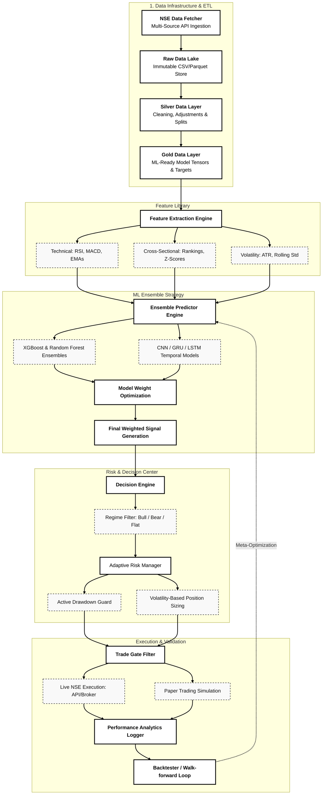

#  Quant Engine: NSE Cross-Sectional Swing Alpha

[](https://www.python.org/)
[](https://opensource.org/licenses/MIT)
[](https://www.nseindia.com/)

A high-performance, Machine Learning-driven quantitative trading engine meticulously engineered for the **National Stock Exchange (NSE)**. This system leverages advanced ensemble learning and cross-sectional analysis to capture swing alpha over 3-day horizons.

---

## 💎 Core Methodology

The system implements a **selective, cross-sectional strategy** that focuses on capital survival and consistent compounding through strict drawdown controls.

-   **Asset Universe**: NSE Equities (selected from a survivorship-bias aware universe).
-   **Trading Style**: Cross-sectional & Market-neutral components.
-   **Holding Period**: Fixed **3 trading days**.
-   **Prediction Target**: `log(Close[t+3] / Close[t])` (3-day log-returns).
-   **Objective**: 30% CAGR with a maximum drawdown limit of 15–20%.

---

## 🏗️ System Architecture



---

The engine is modularized into specialized layers for high maintainability and performance:

| Component | Description |
| :--- | :--- |
| **`src/`** | Core library containing model training, feature engineering, and data preprocessing. |
| **`live/`** | Deployment scripts for live trading and portfolio monitoring. |
| **`production/`** | The "Production-Ready" engine including risk management, ensemble predictors, and decision engines. |
| **`engine/`** | Specialized logic for the backtester and core loading mechanisms. |
| **`docs/`** | Comprehensive architectural and development documentation. |

---

## 🛠️ Tech Stack & Key Features

-   **Machine Learning**: Ensemble of **XGBoost**, **Random Forest**, **LSTM**, **GRU**, and **CNN** for robust signal generation.
-   **Adaptive Risk Manager**: Dynamic position sizing, regime detection, and volatility-adjusted entry thresholds.
-   **Automated Pipeline**: End-to-end data fetching and processing through the `lake/` data management system.
-   **Backtesting Suite**: Walk-forward validation and Monte Carlo simulations to prevent overfitting.

---

## 🚀 Quick Start

### Installation
1.  **Clone the Repository**:
    ```bash
    git clone https://github.com/N0AHZACH/Quant_Engine.git
    cd Quant_Engine
    ```
2.  **Install Dependencies**:
    ```bash
    pip install -r requirements.txt
    ```

### Execution
-   **Train the Pipeline**:
    ```bash
    python src/train_full_pipeline.py
    ```
-   **Run Backtests**:
    ```bash
    python backtest/run_backtest.py
    ```
-   **Live Monitoring**:
    ```bash
    python live/live_trader_v2.py
    ```

---

## ✅ Performance Targets Checklist

-   [ ] **CAGR**: Target $\geq$ 30%
-   [ ] **Max Drawdown**: Target $\leq$ 20%
-   [ ] **Win Rate**: Target 40% – 55%
-   [ ] **Sharpe Ratio**: Target $\geq$ 2.0
-   [ ] **Profit Factor**: Target 1.6 – 2.3

---

## ⚠️ Disclaimer
This system is for research purposes only. Quantitative trading involves significant risk of loss. Always perform rigorous walk-forward backtesting and paper trading before committing real capital.

---

Developed by [N0AHZACH](https://github.com/N0AHZACH)
