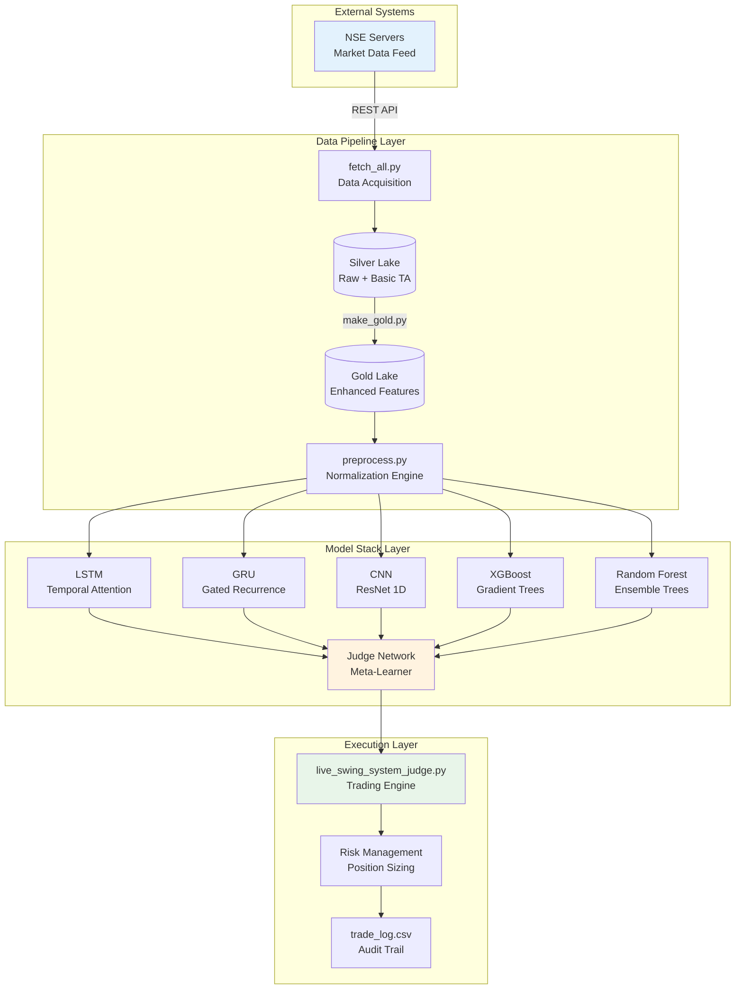
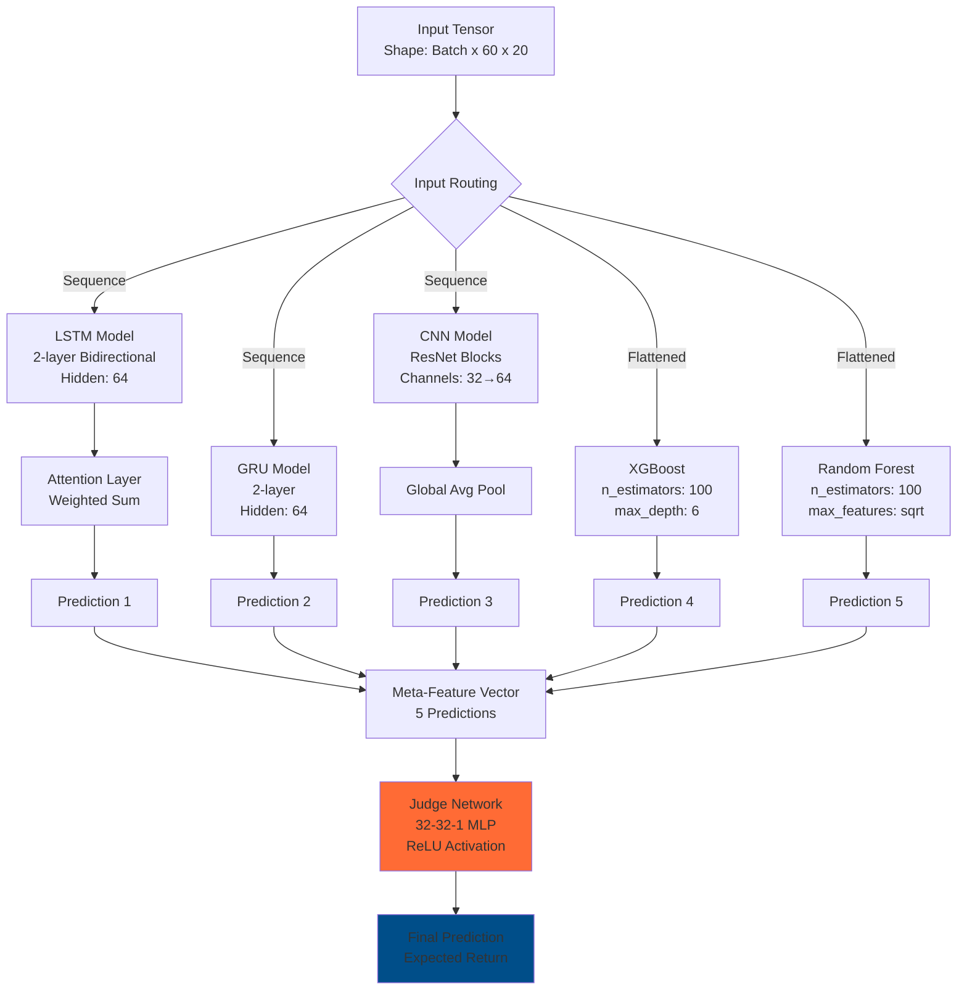
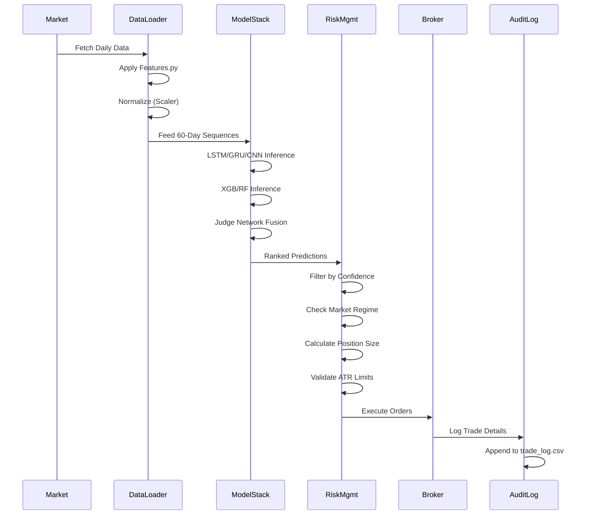
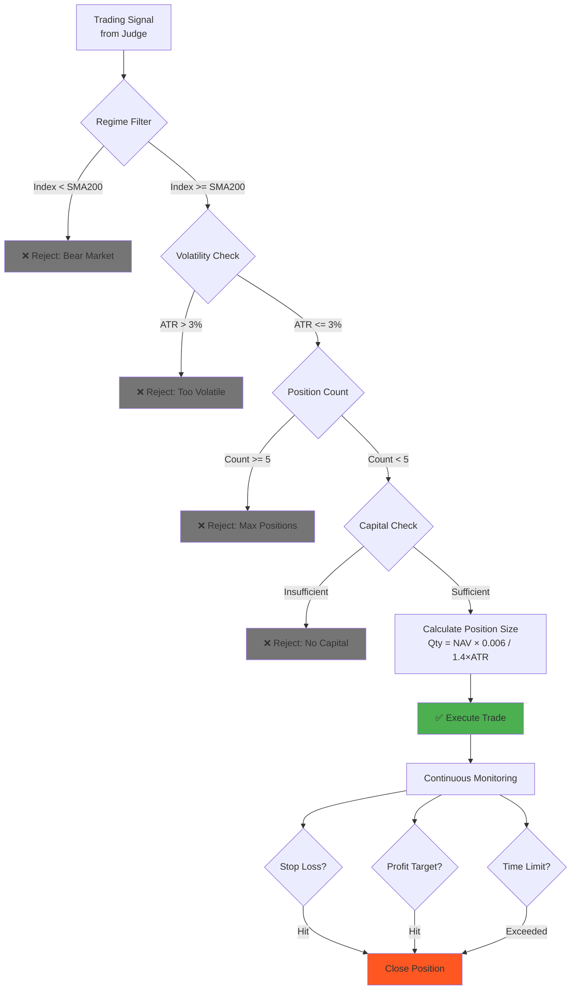
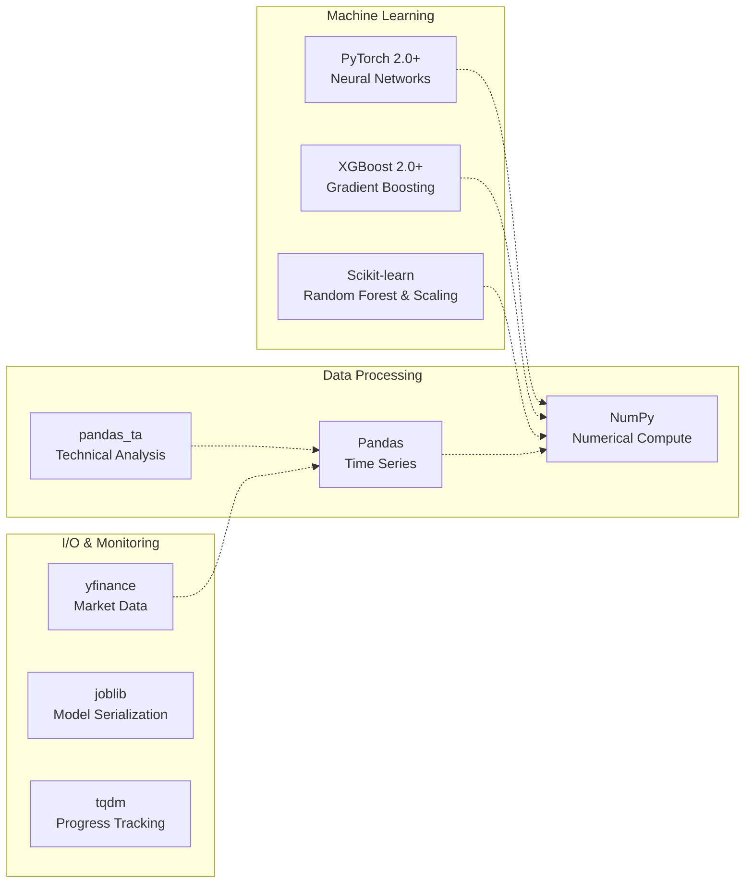
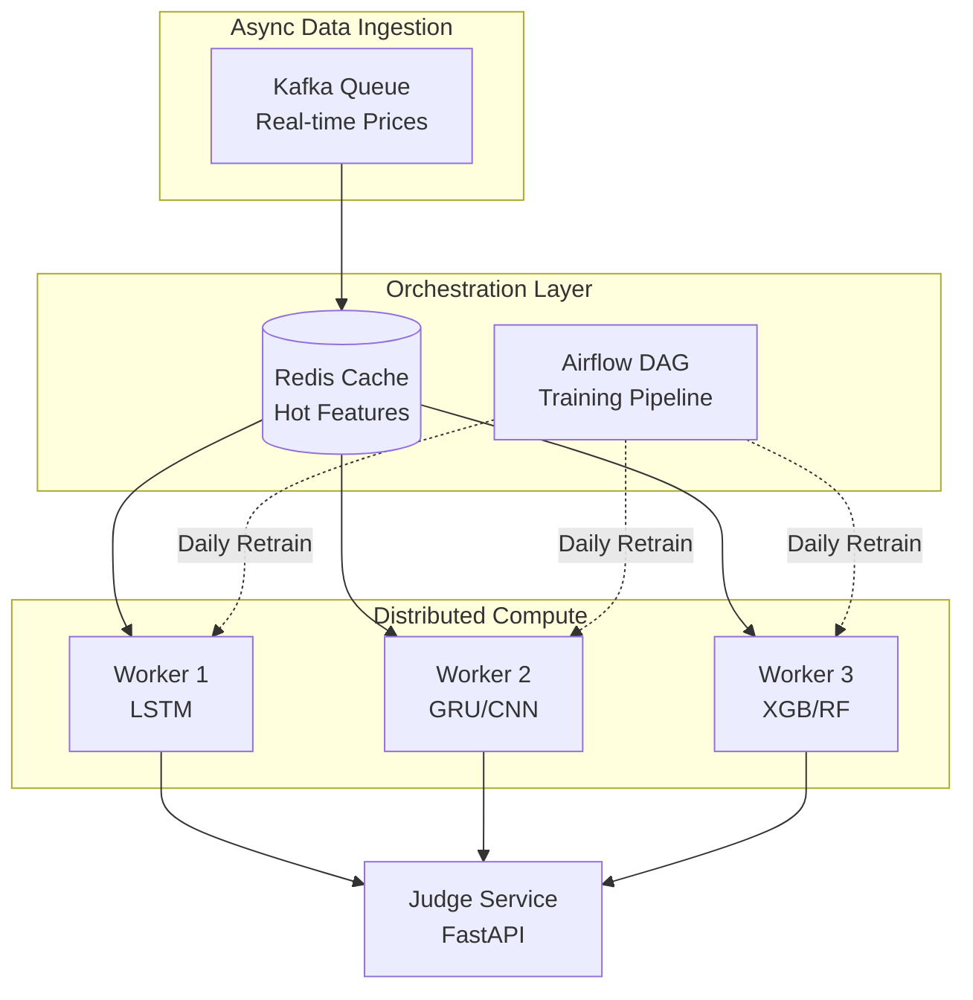

# System Architecture

## Overview

Quant_Engine implements a hierarchical ensemble learning architecture for quantitative trading on the NSE. The system consists of three main subsystems: **Data Pipeline**, **Model Stack**, and **Execution Engine**.

---

## High-Level System Architecture

---

## Data Pipeline Architecture

### The Lake Architecture (Medallion Pattern)

```mermaid
graph LR
    subgraph Bronze["Bronze Layer (Implicit)"]
        API[NSE API Response<br/>Raw JSON/CSV]
    end
    
    subgraph Silver["Silver Layer"]
        S1[Raw OHLCV]
        S2[Basic Indicators<br/>RSI, EMA, Log Returns]
        S3[Data Validation<br/>NaN Handling]
    end
    
    subgraph Gold["Gold Layer"]
        G1[18 Technical Features<br/>MFI, MACD, ADX, ATR, OBV, BB]
        G2[Time Embeddings<br/>Sin/Cos Cyclical]
        G3[Lag Features<br/>Velocity Signals]
    end
    
    subgraph Platinum["Platinum Layer (Alpha Factory)"]
        P1[20 Elite Features<br/>Yang-Zhang Vol, Z-Scores]
        P2[MinMax Normalization<br/>Per-Stock Scaling]
        P3[Sequence Generation<br/>60-Day Windows]
    end
    
    API --> S1 --> S2 --> S3
    S3 --> G1 --> G2 --> G3
    G3 --> P1 --> P2 --> P3
    
    style Bronze fill:#cd7f32,color:#fff
    style Silver fill:#c0c0c0
    style Gold fill:#ffd700
    style Platinum fill:#e5e4e2
```

**Storage Locations**:
- **Silver**: `lake/silver/*.csv` (1900+ files, ~500MB)
- **Gold**: `lake/gold/*.csv` (1900+ files, ~800MB)
- **Platinum**: `lake/processed_market.npz` (Compressed, ~200MB)

---

## Model Stack Architecture

### Hierarchical Ensemble Design

The system implements a **two-tier ensemble**:

1. **Tier 1 (Base Learners)**: 5 heterogeneous models
2. **Tier 2 (Meta-Learner)**: Judge Network for model fusion

### Model Specifications

| Model | Type | Input Shape | Output | Parameters |
|:------|:-----|:------------|:-------|:-----------|
| **LSTM** | Recurrent NN | (B, 60, 20) | (B, 1) | ~100K |
| **GRU** | Recurrent NN | (B, 60, 20) | (B, 1) | ~80K |
| **CNN** | Convolutional NN | (B, 20, 60) | (B, 1) | ~50K |
| **XGBoost** | Gradient Boosting | (B, 1200) | (B,) | ~500K |
| **Random Forest** | Ensemble Trees | (B, 1200) | (B,) | ~300K |
| **Judge** | Meta-MLP | (B, 5) | (B, 1) | 1.1K |

**Total Model Size**: ~350MB (PyTorch) + ~200MB (XGBoost/RF)

---

## Execution Architecture

### Live Trading System Flow

### Risk Management Layer

---

## Technology Stack

### Core Dependencies

### Hardware Requirements

| Resource | Minimum | Recommended |
|:---------|:--------|:------------|
| **CPU** | 4 cores | 8+ cores |
| **RAM** | 8 GB | 16 GB |
| **GPU** | None | CUDA-compatible (3GB+ VRAM) |
| **Storage** | 5 GB | 10 GB SSD |
| **Network** | Broadband | Low-latency (<50ms to NSE) |

---

## Design Patterns & Principles

### 1. Separation of Concerns
- **Data Layer**: Pure ETL, no business logic
- **Model Layer**: Stateless prediction functions
- **Execution Layer**: Isolated risk management

### 2. Idempotency
- All data processing scripts support resume functionality
- Model training uses fixed random seeds
- Trade logs are append-only (immutable)

### 3. Walk-Forward Validation
- Training window: 756 days (3 years)
- Testing window: 63 days (3 months)
- Prevents look-ahead bias and overfitting

### 4. Defensive Programming
- Null checks on all DataFrame operations
- MinMaxScaler per-stock to handle different scales
- Try-catch blocks in data acquisition loops

---

## Scalability Considerations

### Current Limitations
- **Single-threaded execution**: Live trading runs on one CPU core
- **In-memory data loading**: Full dataset must fit in RAM
- **Sequential model inference**: No batch parallelization

### Future Architecture (Proposed)

---

## Security & Compliance

### Data Security
- No API keys stored in code (environment variables)
- Trade logs are local-only (not transmitted)
- Model weights are versioned with git-lfs

### Regulatory Considerations
> [!WARNING]
> This system is designed for **research and backtesting**. Live trading requires:
> - Broker API integration with proper authentication
> - Compliance with SEBI (Securities and Exchange Board of India) regulations
> - Real-time risk monitoring and circuit breakers

---

## Monitoring & Observability

### Key Metrics Tracked

| Metric | Location | Purpose |
|:-------|:---------|:--------|
| **Sharpe Ratio** | `run_metrics.py` | Risk-adjusted returns |
| **Max Drawdown** | `train_full_pipeline.py` | Capital preservation |
| **Win Rate** | `trade_log.csv` | Strategy effectiveness |
| **Execution Latency** | Logs (stdout) | Performance optimization |

### Logging Strategy
- **INFO**: Normal operations, successful trades
- **WARNING**: Failed data fetches, skipped stocks
- **ERROR**: Model loading failures, critical exceptions

---

## References

- **Data Source**: NSE EQUITY_L.csv (Official Archive)
- **Model Inspiration**: "Attention Is All You Need" (Vaswani et al., 2017)
- **Risk Framework**: "Safe Haven Investing" (Marks, 2011)
