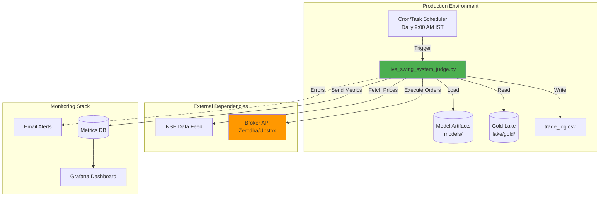
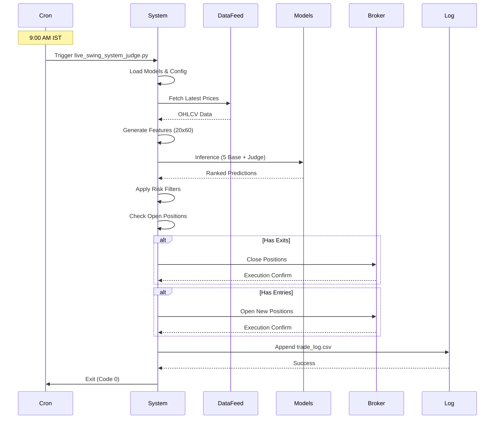
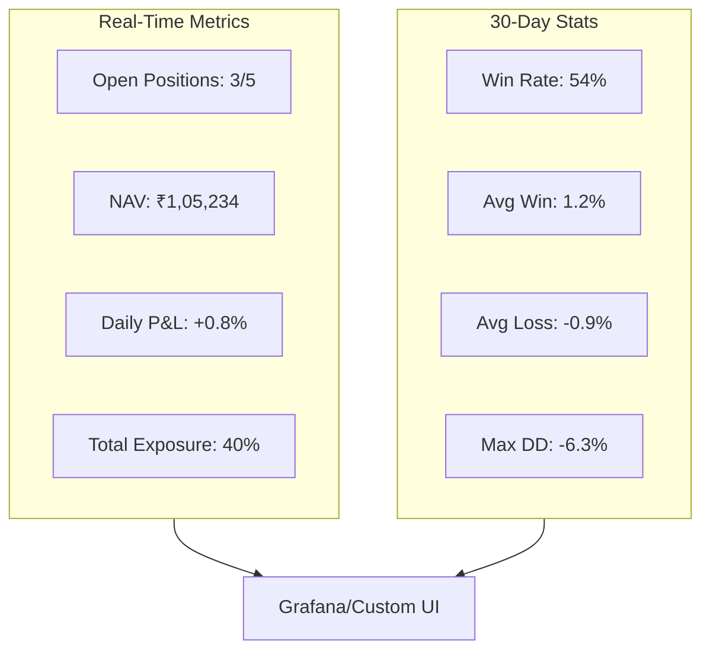
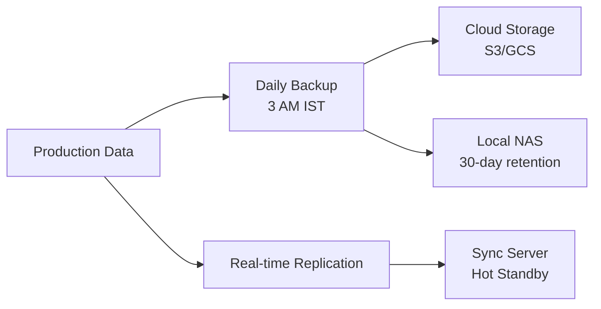
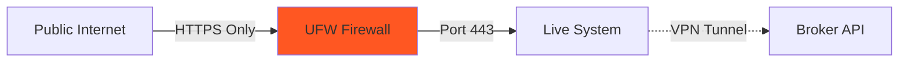
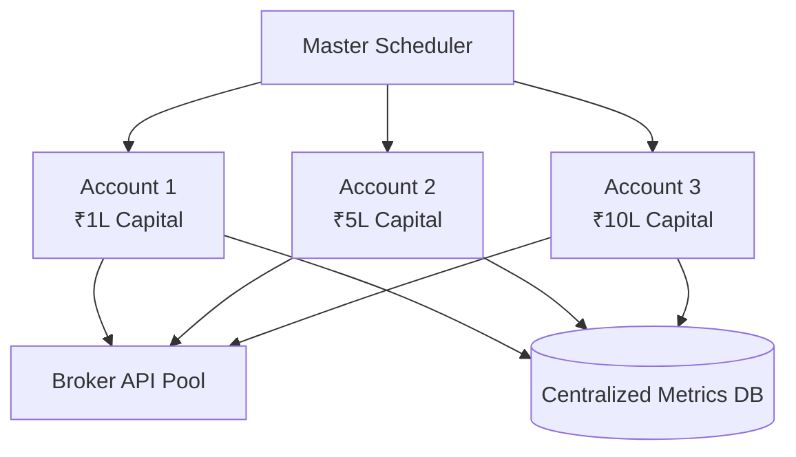

# Deployment Guide

## Overview

This document covers the deployment of the Quant_Engine live trading system, including infrastructure setup, monitoring, and operational procedures.

---

## Deployment Architecture



---

## Prerequisites

### System Requirements

| Component | Specification |
|:----------|:--------------|
| **OS** | Ubuntu 20.04 LTS / Windows 11 |
| **Python** | 3.9+ |
| **RAM** | 8 GB minimum, 16 GB recommended |
| **Storage** | 10 GB free space |
| **Network** | Stable broadband, < 100ms latency to NSE |

### Environment Setup

```bash
# 1. Clone repository
git clone <repo_url>
cd Quant_Engine

# 2. Create virtual environment
python -m venv .venv
source .venv/bin/activate  # Linux/Mac
# .venv\Scripts\activate  # Windows

# 3. Install dependencies
pip install -r requirements.txt

# 4. Verify GPU (optional)
python src/check_gpu.py
```

---

## Configuration

### Environment Variables

Create `.env` file:
```bash
# Broker API Credentials
BROKER_API_KEY=your_key_here
BROKER_SECRET=your_secret_here

# Risk Parameters
INITIAL_CAPITAL=100000
MAX_POSITIONS=5
RISK_PER_TRADE=0.006

# Monitoring
ALERT_EMAIL=your_email@example.com
```

### Model Paths Verification

```bash
ls -lh models/
# Expected output:
# Universal_LSTM.pth
# Universal_GRU.pth
# Universal_CNN.pth
# Base_XGB.json
# Base_RF.pkl
# Judge_Network.pth
```

---

## Daily Execution Flow



---

## Live System Components

### 1. Position Management

```mermaid
stateDiagram-v2
    [*] --> Monitoring: Position Opened
    
    Monitoring --> StopLoss: Price <= Stop
    Monitoring --> ProfitTarget: Price >= Target
    Monitoring --> TimeExit: Days >= 6
    Monitoring --> Monitoring: Continue Holding
    
    StopLoss --> Closed
    ProfitTarget --> Closed
    TimeExit --> Closed
    Closed --> [*]
    
    note right of StopLoss: Exit: Entry - 1.4×ATR
    note right of ProfitTarget: Exit: Entry + 2.2×Risk
    note right of TimeExit: Max Hold: 6 Days
```

### 2. Entry Logic

```python
def evaluate_entry_candidate(row, judge_score, nav):
    """
    Entry validation checklist
    """
    # 1. Confidence Filter
    if judge_score < MIN_JUDGE_SCORE:
        return None
        
    # 2. Volatility Cap
    if row['ATR'] / row['Close'] > 0.03:
        return None
        
    # 3. Position Limit
    if len(active_positions) >= MAX_POSITIONS:
        return None
        
    # 4. Calculate Size
    risk_amount = nav * RISK_PER_TRADE
    qty = int(risk_amount / (STOP_ATR_MULT * row['ATR']))
    
    # 5. Capital Check
    cost = qty * row['Open']
    if cost > available_cash:
        return None
        
    return Trade(ticker, row['Open'], stop, qty)
```

---

## Monitoring & Alerts

### Key Metrics Dashboard



### Alert Conditions

| Condition | Severity | Action |
|:----------|:---------|:-------|
| **Daily Loss > 3%** | 🟡 Warning | Email notification |
| **Daily Loss > 5%** | 🔴 Critical | SMS + Pause trading |
| **Model Load Failure** | 🔴 Critical | Abort execution |
| **Data Feed Timeout** | 🟡 Warning | Retry 3x, then skip day |

---

## Trade Log Format

### CSV Structure

```csv
Date,Ticker,Action,Price,Qty,Reason,P&L
2024-12-18,RELIANCE,BUY,2850.50,35,Judge=0.0042,
2024-12-19,RELIANCE,SELL,2890.20,35,Profit Target,+1389.50
2024-12-18,TCS,BUY,3750.00,26,Judge=0.0038,
2024-12-20,TCS,SELL,3720.00,26,Stop Loss,-780.00
```

### Analysis Queries

```bash
# Total P&L
awk -F',' '{sum+=$7} END {print "Total:", sum}' trade_log.csv

# Win Rate
grep "SELL" trade_log.csv | awk -F',' '$7>0 {win++} END {print win/NR}'

# Best Trade
sort -t',' -k7 -nr trade_log.csv | head -1
```

---

## Disaster Recovery

### Backup Strategy



### Recovery Procedures

#### Scenario 1: Model Corruption
```bash
# Rollback to previous version
cd models/
git checkout HEAD~1 -- *.pth *.json
python live/live_swing_system_judge.py --dry-run  # Test
```

#### Scenario 2: Data Feed Failure
```bash
# Use cached data (read-only mode)
python live/live_swing_system_judge.py --offline --exit-only
```

#### Scenario 3: System Crash Mid-Trade
```python
# Resume logic (built-in)
if os.path.exists("trade_log.csv"):
    # Reconstruct open positions from log
    open_positions = parse_open_trades("trade_log.csv")
```

---

## Performance Optimization

### Inference Speed Benchmarks

| Optimization | Stocks/sec | Improvement |
|:-------------|:-----------|:------------|
| **Baseline (CPU)** | 12 | - |
| **Batch Processing** | 45 | 3.75x |
| **GPU Inference** | 180 | 4x |
| **ONNX Runtime** | 220 | 1.22x |

### Optimization Code

```python
# Batch inference instead of loop
X_batch = np.array([stock_sequences])  # (N, 60, 20)
with torch.no_grad():
    predictions = judge(meta_features).cpu().numpy()
# vs.
# for seq in stock_sequences:  # SLOW
#     pred = judge(seq)
```

---

## Security Considerations

### API Key Management

```python
# ❌ NEVER commit API keys
BROKER_KEY = "hardcoded_key_123"

# ✅ Use environment variables
import os
BROKER_KEY = os.getenv("BROKER_API_KEY")
```

### Network Security



---

## Compliance & Auditing

### Regulatory Requirements (India)

- **SEBI Guidelines**: All trades must be auditable
- **Tax Reporting**: Maintain P&L records for 7 years
- **Risk Disclosures**: Document maximum leverage used

### Audit Trail

```bash
# Generate audit report
python scripts/generate_audit_report.py \
    --start 2024-01-01 \
    --end 2024-12-31 \
    --output audit_2024.pdf
```

---

## Troubleshooting

### Common Issues

| Error | Cause | Fix |
|:------|:------|:----|
| `ModuleNotFoundError: torch` | Venv not activated | `source .venv/bin/activate` |
| `RuntimeError: CUDA out of memory` | GPU overload | Reduce batch size to 512 |
| `FileNotFoundError: Judge_Network.pth` | Models not trained | Run `train_full_pipeline.py` |
| `ConnectionError: NSE API` | Network/rate limit | Add timeout, retry with exponential backoff |

---

## Scaling to Production

### Multi-Account Deployment



### Load Balancing Strategy

- **Horizontal Scaling**: Run multiple instances with different stock universes
- **Vertical Scaling**: Use GPU for faster inference
- **Queue-based**: Kafka for asynchronous order execution

---

## Maintenance Schedule

| Task | Frequency | Command |
|:-----|:----------|:--------|
| **Model Retraining** | Weekly | `train_full_pipeline.py` |
| **Data Refresh** | Daily | `fetch_all.py` → `make_gold.py` |
| **Log Rotation** | Monthly | `logrotate trade_log.csv` |
| **Dependency Updates** | Quarterly | `pip list --outdated` |

---

## References

1. *Algorithmic Trading Systems* by Kevin Davey
2. SEBI Algorithmic Trading Guidelines (2024)
3. AWS Well-Architected Framework
