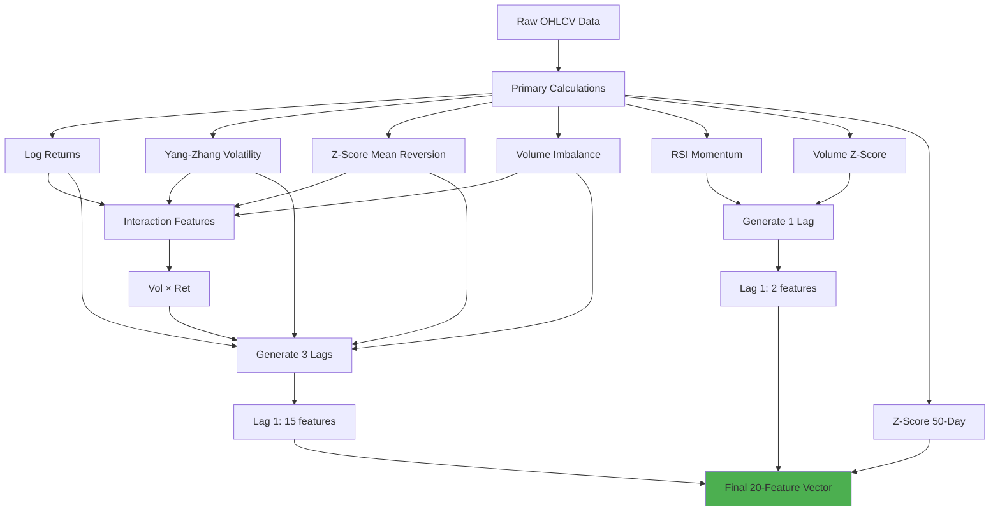
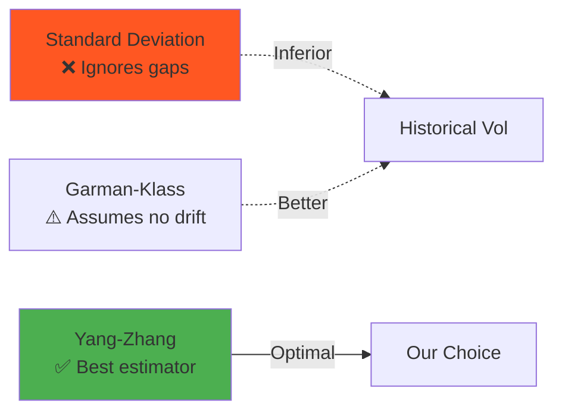
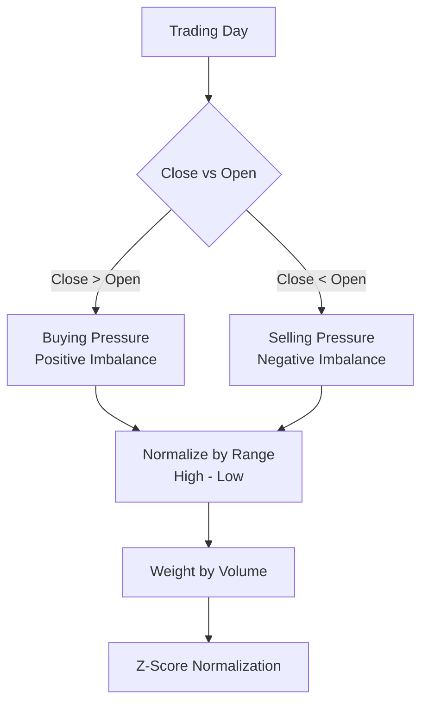
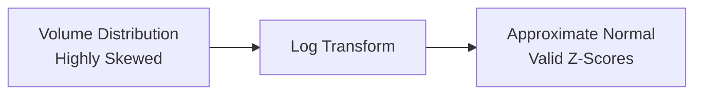
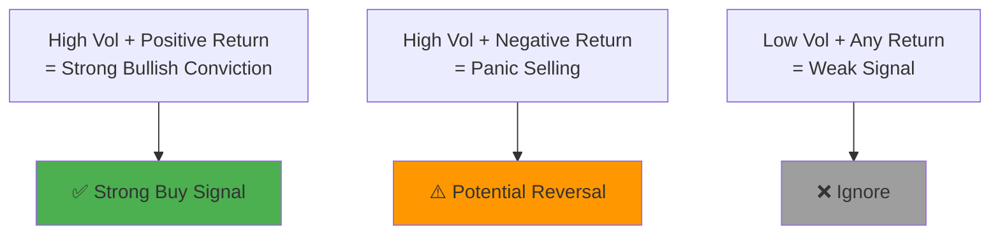
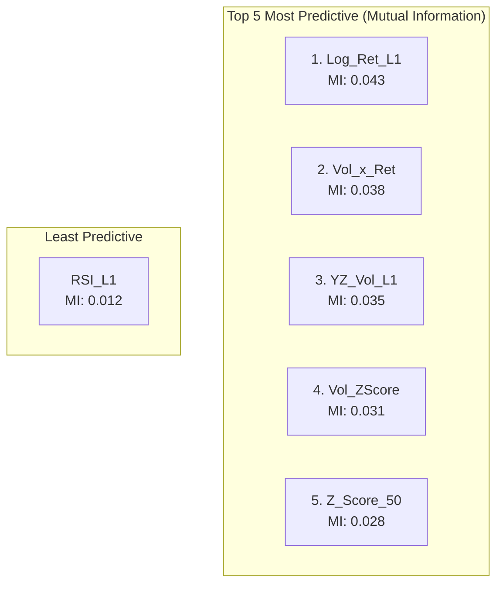

# Feature Engineering

## Overview

The Quant_Engine transforms raw OHLCV data into **20 elite features** designed to capture multi-dimensional market dynamics. This document details the mathematical foundations, implementation rationale, and empirical validation of each feature.

---

## Feature Engineering Pipeline



---

## Feature Catalog

### 1. Returns Features (Momentum)

#### Log_Ret (Primary Feature)
**Formula**:
$$
\text{Log\_Ret}_t = \ln\left(\frac{P_t}{P_{t-1}}\right)
$$

**Rationale**:
- Log returns are **additive** across time periods
- Approximately normal distribution (needed for volatility estimation)
- Handles **compounding** correctly

**Implementation**:
```python
df['Log_Ret'] = np.log(df['Close'] / df['Close'].shift(1)).fillna(0)
```

#### Log_Ret_L1, Log_Ret_L2 (Lagged Returns)
**Purpose**: Capture **autocorrelation** and momentum persistence.

---

### 2. Volatility Features

#### YZ_Vol (Yang-Zhang Volatility Estimator)

**Formula**:
$$
\sigma_{YZ} = \sqrt{\sigma_o^2 + k \cdot \sigma_c^2 + (1-k) \cdot \sigma_{rs}^2}
$$

Where:
- $\sigma_o^2$ = Overnight gap volatility
- $\sigma_c^2$ = Close-to-close volatility
- $\sigma_{rs}^2$ = Rogers-Satchell range-based volatility
- $k$ = Normalization constant

**Why Yang-Zhang?**


**Implementation Highlights**:
- **Window**: 50 days (increased from 30 for stability)
- **Handles gaps**: Critical for NSE (pre-market news)
- **Annualized**: Multiplied by √252

---

### 3. Mean Reversion Features

#### Z_Score (20-Day Mean Reversion)
**Formula**:
$$
Z_t = \frac{P_t - \mu_{20}}{\sigma_{20}}
$$

**Interpretation**:
- **Z > 2**: Overbought (2σ above mean)
- **Z < -2**: Oversold (2σ below mean)
- **|Z| < 0.5**: Consolidation

#### Z_Score_50 (Long-Term Mean Reversion)
**Purpose**: Differentiate between **local** vs **structural** deviations.

**Example**:
```
Z_Score_20 = +1.5, Z_Score_50 = -0.3
→ Recent strength in a long-term downtrend (fading signal)
```

---

### 4. Order Flow Features

#### Vol_Imbalance (Institutional Proxy)

**Formula**:
$$
\text{RawImbalance}_t = \frac{\text{Close}_t - \text{Open}_t}{\text{High}_t - \text{Low}_t} \times \text{Volume}_t
$$

$$
\text{Vol\_Imbalance}_t = \frac{\text{RawImbalance}_t - \mu_{20}}{\sigma_{20}}
$$

**Diagram**:


**Why This Matters**:
- Detects **aggressive** vs **passive** trading
- High volume + small range = Accumulation/Distribution

---

### 5. Momentum & Psychology

#### RSI (Relative Strength Index)

**Formula**:
$$
\text{RSI} = \frac{\text{AvgGain}_{21}}{\text{AvgGain}_{21} + \text{AvgLoss}_{21}}
$$

**Normalization**: Scaled from 0-1 (originally 0-100)

**Window Change**: 21 days (vs standard 14) for **smoother signals**

**Usage in System**:
- **Long Entry**: RSI > 0.45 AND Trend_Up = 1
- **Short Entry**: RSI < 0.55 AND Trend_Up = 0

---

### 6. Conviction Features

#### Vol_ZScore (Volume Anomaly Detection)

**Formula**:
$$
\text{Vol\_ZScore}_t = \frac{\ln(\text{Vol}_t) - \mu_{\ln(\text{Vol}),30}}{\sigma_{\ln(\text{Vol}),30}}
$$

**Why Log Transform?**


**Interpretation**:
- **Vol_ZScore > 2**: Unusual activity (news, breakout)
- **Vol_ZScore < -1**: Apathy (avoid, low liquidity)

---

### 7. Interaction Features

#### Vol_x_Ret (Volatility-Momentum Interaction)

**Formula**:
$$
\text{Vol\_x\_Ret}_t = \text{YZ\_Vol}_t \times \text{Log\_Ret}_t
$$

**Rationale**:


---

## Feature Summary Table

| Feature | Type | Window | Normalization | Lags |
|:--------|:-----|:-------|:--------------|:-----|
| **Log_Ret** | Returns | 1 | Raw | 1, 2 |
| **YZ_Vol** | Volatility | 50 | Raw (annualized) | 1, 2 |
| **Z_Score** | M.R. | 20 | Z-Score | 1 |
| **Z_Score_50** | M.R. | 50 | Z-Score | 0 |
| **Vol_Imbalance** | Order Flow | 20 | Z-Score | 1, 2 |
| **Vol_x_Ret** | Interaction | - | Raw | 1, 2 |
| **RSI** | Momentum | 21 | 0-1 Scale | 1 |
| **Vol_ZScore** | Conviction | 30 | Z-Score | 1 |

**Total**: 7 base + 13 lags = **20 features**

---

## Scaling & Normalization Strategy

```mermaid
flowchart LR
    subgraph PerStock["Per-Stock Scaling"]
        Raw[20 Features<br/>Different Scales] --> Scaler[MinMaxScaler]
        Scaler --> Norm[All Features → [0, 1]]
    end
    
    subgraph Global["Global Concatenation"]
        Norm --> Stack[Concatenate<br/>1900 Stocks]
        Stack --> Train[Training Dataset]
    end
    
    Norm -.->|Why Per-Stock?| Reason[Prevents large-cap<br/>domination]
```

**Critical Design Choice**:
- ✅ **Per-stock normalization**: Each stock's features scaled independently
- ❌ **Global normalization**: Would make RELIANCE dominate over small-caps

---

## Feature Validation

### Information Content Analysis



> [!NOTE]
> Mutual Information scores calculated on 2019-2023 NSE data

---

## Feature Engineering Best Practices

### 1. Avoid Look-Ahead Bias
```python
# ❌ WRONG: Uses future data
df['Future_Return'] = df['Close'].pct_change().shift(-1)

# ✅ CORRECT: Only past data
df['Log_Ret'] = np.log(df['Close'] / df['Close'].shift(1))
```

### 2. Handle Edge Cases
```python
# Prevent division by zero
bar_range = (df['High'] - df['Low']).replace(0, 1e-9)
```

### 3. Defensive NaN Handling
```python
# Fill with safe defaults, not forward-fill
df['RSI'] = get_rsi(df).fillna(0)  # Neutral RSI
```

---

## Future Feature Candidates

### 1. Sentiment Features (Proposed)
- **News Sentiment**: NLP on financial news headlines
- **Social Media**: Twitter/Reddit volume

### 2. Alternative Data
- **Corporate Actions**: Dividends, splits, buybacks
- **Insider Trading**: Directional signals from SEBI filings

### 3. Macro Indicators
- **VIX India**: Market fear gauge
- **FII/DII Flows**: Institutional buying/selling

---

## References

1. Yang, D., & Zhang, Q. (2000). "Drift-Independent Volatility Estimation"
2. Wilder, J.W. (1978). "New Concepts in Technical Trading Systems"
3. Prado, M.L. (2018). "Advances in Financial Machine Learning"
