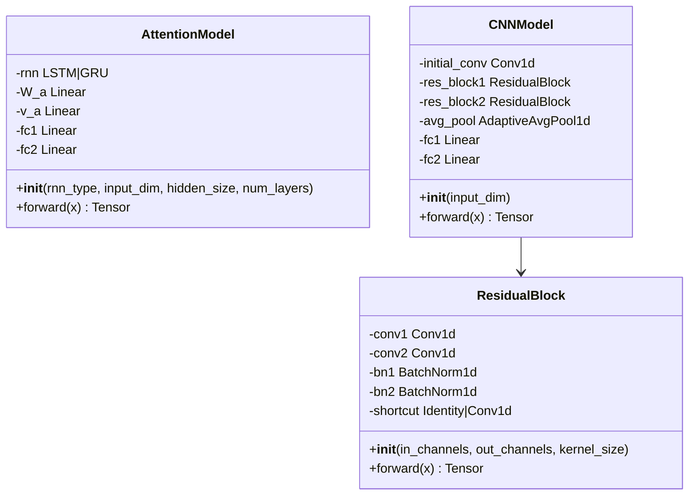
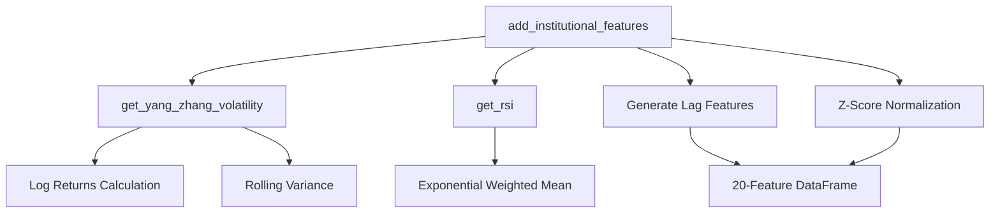
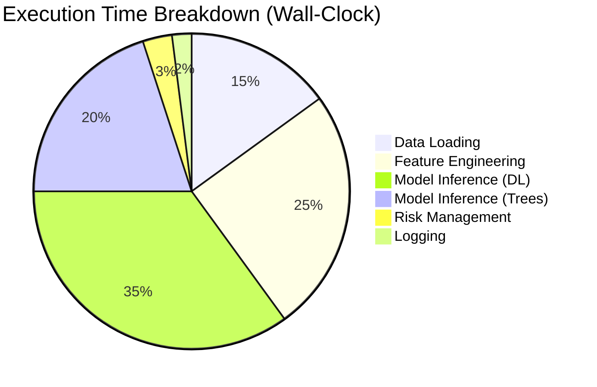
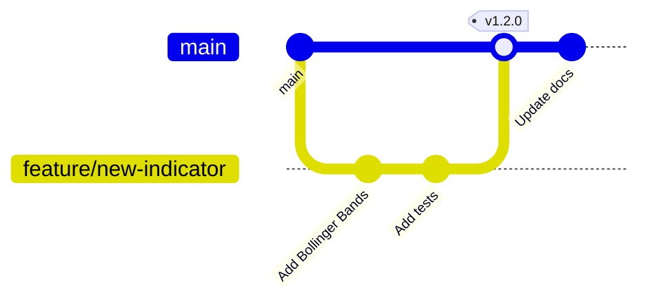

# Implementation Reference

## Overview

This document provides a detailed code-level reference for developers working on the Quant_Engine codebase.

---

## Project Structure

```
Quant_Engine/
├── src/                          # Core engine logic
│   ├── __init__.py
│   ├── model.py                  # Neural network architectures
│   ├── features.py               # Feature engineering
│   ├── fetch_all.py              # Data acquisition
│   ├── make_gold.py              # Gold layer processing
│   ├── preprocess.py             # Normalization engine
│   ├── train_full_pipeline.py    # Walk-forward training
│   └── run_metrics.py            # Performance analytics
├── live/                         # Production trading
│   ├── live_swing_system_judge.py   # Main execution loop
│   └── trade_log.csv             # Trade history
├── models/                       # Trained model artifacts
│   ├── Universal_LSTM.pth
│   ├── Universal_GRU.pth
│   ├── Universal_CNN.pth
│   ├── Base_XGB.json
│   ├── Base_RF.pkl
│   └── Judge_Network.pth
├── lake/                         # Data storage
│   ├── silver/                   # Raw + basic TA
│   ├── gold/                     # Enhanced features
│   └── processed_market.npz      # Normalized sequences
├── docs/                         # Documentation
│   ├── ARCHITECTURE.md
│   ├── FEATURES.md
│   ├── TRAINING.md
│   ├── DEPLOYMENT.md
│   └── IMPLEMENTATION.md (this file)
└── requirements.txt              # Dependencies
```

---

## Core Modules

### `model.py` - Neural Network Architectures



#### Key Functions

**AttentionModel.forward()**
```python
def forward(self, x):
    """
    Args:
        x: Tensor of shape (batch_size, seq_len, features)
           e.g., (512, 60, 20)
    
    Returns:
        Tensor of shape (batch_size, 1)
        Predicted return for next day
    """
    r_out, _ = self.rnn(x)  # (B, 60, 64)
    attn_scores = self.v_a(torch.tanh(self.W_a(r_out)))  # (B, 60, 1)
    attn_weights = F.softmax(attn_scores, dim=1)
    context = torch.sum(attn_weights * r_out, dim=1)  # (B, 64)
    out = F.relu(self.fc1(context))
    return self.fc2(out)
```

---

### `features.py` - Feature Engineering Engine

#### Function Map



#### Critical Parameters

| Function | Parameter | Default | Tunable Range |
|:---------|:----------|:--------|:--------------|
| `get_yang_zhang_volatility` | window | 50 | 30-100 |
| `get_rsi` | window | 21 | 14-30 |
| `add_institutional_features` | - | - | Fixed pipeline |

---

### `train_full_pipeline.py` - Training Orchestrator

#### Execution Flow

```mermaid
stateDiagram-v2
    [*] --> LoadData: Load Universal Models
    LoadData --> CacheStocks: Load & Cache 1900+ Stocks
    CacheStocks --> WalkForward: Initialize Walk-Forward Loop
    
    state WalkForward {
        [*] --> Sample: Sample 150 Stocks
        Sample --> BuildSequences: Build Training Sequences
        BuildSequences --> MetaFeatures: Generate Meta-Features
        MetaFeatures --> TrainJudge: Train Judge Network (20 epochs)
        TrainJudge --> TestWindow: Test on 63-Day Window
        TestWindow --> Metrics: Calculate Sharpe/DD/CAGR
        Metrics --> [*]
    }
    
    WalkForward --> CheckDone{More Windows?}
    CheckDone -->|Yes| WalkForward
    CheckDone -->|No| SaveModels
    SaveModels --> [*]
```

#### Key Data Structures

```python
# Stock cache structure
stock_cache = [
    {
        'ticker': 'RELIANCE_processed.csv',
        'dates': DatetimeIndex,
        'data_scaled': np.ndarray (N, 20),
        'realized_ret': np.ndarray (N,),
        'vol': np.ndarray (N,),
        'rsi': np.ndarray (N,),
        'trend': np.ndarray (N,),
        'full_len': int
    },
    ...
]
```

---

### `live_swing_system_judge.py` - Live Trading Engine

#### Main Loop Pseudocode

```python
def run():
    # 1. Initialization
    models = load_models(device)
    index_df = load_index_data()
    stock_data = load_all_stocks()
    scaler = fit_global_scaler(stock_data)
    
    cash = INITIAL_CAPITAL
    trades = []
    
    # 2. Daily Loop
    for date in trading_dates:
        # A. Exit Management
        for trade in trades:
            check_stop_loss(trade, date)
            check_profit_target(trade, date)
            check_time_limit(trade, date)
        
        # B. Update NAV
        nav = cash + calculate_open_position_value(trades, date)
        
        # C. Regime Filter
        if index_df.loc[date, 'Close'] < index_df.loc[date, 'SMA200']:
            continue  # Skip day
        
        # D. Generate Signals
        X_batch = build_feature_matrix(stock_data, date)
        meta_features = generate_meta(X_batch, models)
        scores = judge(meta_features)
        
        # E. Rank & Filter
        candidates = rank_by_score(scores)
        filtered = apply_risk_filters(candidates)
        
        # F. Execute Entries
        for candidate in filtered[:MAX_POSITIONS]:
            execute_trade(candidate, cash, nav)
        
        # G. Log
        update_trade_log(trades, date)
```

---

## API Reference

### Model Loading

```python
def load_universal_models(device: torch.device) -> Tuple[nn.Module, ...]:
    """
    Loads all 5 base learners from disk.
    
    Args:
        device: torch.device ('cuda' or 'cpu')
    
    Returns:
        Tuple of (lstm, gru, cnn, xgb_model, rf_model)
    
    Raises:
        FileNotFoundError: If model files missing
        RuntimeError: If model architecture mismatch
    """
```

### Feature Generation

```python
def add_institutional_features(df: pd.DataFrame) -> pd.DataFrame:
    """
    Transforms OHLCV to 20 elite features.
    
    Args:
        df: DataFrame with columns ['Open', 'High', 'Low', 'Close', 'Volume']
           Index must be DatetimeIndex
    
    Returns:
        DataFrame with 20 feature columns, NaNs filled with 0
    
    Example:
        >>> raw_df = pd.read_csv('stock.csv', index_col='Date', parse_dates=True)
        >>> features = add_institutional_features(raw_df)
        >>> features.shape
        (1200, 20)
    """
```

### Meta-Learning

```python
def generate_meta_features(
    X_sequence: np.ndarray,
    universal_models: Tuple,
    device: torch.device
) -> np.ndarray:
    """
    Generates 5-prediction meta-feature matrix.
    
    Args:
        X_sequence: Shape (N, 60, 20) - Normalized sequences
        universal_models: Tuple of 5 trained models
        device: Computation device
    
    Returns:
        Shape (N, 5) - [P_LSTM, P_GRU, P_CNN, P_XGB, P_RF]
    
    Performance:
        - CPU: ~12 stocks/second
        - GPU: ~180 stocks/second
    """
```

---

## Configuration Constants

### Global Constants (from `train_full_pipeline.py`)

```python
# Data Paths
GOLD_FOLDER = "lake/gold"
META_MODEL_PATH = "models/Judge_Network.pth"

# Model Paths
LSTM_PATH = "models/Universal_LSTM.pth"
GRU_PATH = "models/Universal_GRU.pth"
CNN_PATH = "models/Universal_CNN.pth"
XGB_PATH = "models/Base_XGB.json"
RF_PATH = "models/Base_RF.pkl"

# Sequence Parameters
SEQ_LEN = 60
PRINCIPAL = 10000.0

# Risk Parameters
MAX_POSITIONS_PER_DAY = 12
BASE_ALLOCATION = 0.10
TARGET_RISK_PER_TRADE = 0.008
MAX_ALLOWED_VOLATILITY = 0.03
CONFIDENCE_THRESHOLD = 0.0025

# Cost Assumptions
RISK_FREE_RATE = 0.045
TOTAL_COST_PER_TRADE = 0.001  # 0.1% (brokerage + slippage)

# Walk-Forward Windows
TRAIN_WINDOW = 756  # ~3 years
TEST_WINDOW = 63    # ~3 months
JUDGE_EPOCHS = 20
JUDGE_LR = 0.001
BATCH_SIZE = 1024
```

---

## Error Handling Patterns

### Defensive Data Loading

```python
def safe_load_stock(file_path: str) -> Optional[pd.DataFrame]:
    """Robust stock data loader with error handling."""
    try:
        df = pd.read_csv(file_path, index_col=0, parse_dates=True)
        
        # Validation checks
        if len(df) < 300:
            return None
        if df.isnull().sum().sum() > 0.1 * df.size:
            return None
        
        return df.sort_index()
        
    except (pd.errors.ParserError, ValueError, FileNotFoundError):
        return None
```

### Model Inference Safety

```python
@torch.no_grad()
def safe_inference(model: nn.Module, X: torch.Tensor) -> np.ndarray:
    """
    Inference with exception handling.
    Returns zeros on failure to prevent crashes.
    """
    try:
        model.eval()
        output = model(X.to(device))
        return output.cpu().numpy().flatten()
    except RuntimeError as e:
        logging.error(f"Inference failed: {e}")
        return np.zeros(len(X))
```

---

## Testing Strategy

### Unit Tests Structure

```
tests/
├── test_features.py
│   ├── test_yang_zhang_volatility()
│   ├── test_rsi_calculation()
│   └── test_feature_count()
├── test_models.py
│   ├── test_lstm_forward_shape()
│   ├── test_cnn_forward_shape()
│   └── test_judge_network()
└── test_training.py
    ├── test_sequence_generation()
    └── test_meta_feature_generation()
```

### Example Test

```python
def test_feature_count():
    """Verify output has exactly 20 features."""
    df = create_mock_ohlcv(days=500)
    features = add_institutional_features(df)
    
    assert features.shape[1] == 20, \
        f"Expected 20 features, got {features.shape[1]}"
    assert not features.isnull().any().any(), \
        "Features contain NaN values"
```

---

## Performance Profiling

### Bottleneck Analysis



### Optimization Checklist

- [ ] Use `torch.no_grad()` for all inference
- [ ] Batch predictions instead of loops
- [ ] Cache scalers (don't refit daily)
- [ ] Use `joblib.load(..., mmap_mode='r')` for large models
- [ ] Preallocate NumPy arrays where possible

---

## Logging Configuration

```python
import logging

logging.basicConfig(
    level=logging.INFO,
    format='%(asctime)s - %(name)s - %(levelname)s - %(message)s',
    handlers=[
        logging.FileHandler('quant_engine.log'),
        logging.StreamHandler()
    ]
)

logger = logging.getLogger(__name__)
```

### Log Levels Usage

- **DEBUG**: Feature values, intermediate outputs
- **INFO**: Trade executions, daily P&L
- **WARNING**: Skipped stocks, data quality issues
- **ERROR**: Model failures, critical bugs

---

## Database Schema (Future)

### Proposed Timeseries DB Structure

```sql
CREATE TABLE trades (
    id SERIAL PRIMARY KEY,
    timestamp TIMESTAMPTZ NOT NULL,
    ticker VARCHAR(20) NOT NULL,
    action VARCHAR(4) NOT NULL,  -- 'BUY' or 'SELL'
    price DECIMAL(10,2) NOT NULL,
    quantity INT NOT NULL,
    judge_score DECIMAL(6,4),
    pnl DECIMAL(10,2),
    reason VARCHAR(50)
);

CREATE INDEX idx_trades_timestamp ON trades(timestamp);
CREATE INDEX idx_trades_ticker ON trades(ticker);
```

---

## Code Style Guidelines

### Naming Conventions

| Type | Convention | Example |
|:-----|:-----------|:--------|
| **Module** | snake_case | `feature_engineering.py` |
| **Class** | PascalCase | `AttentionModel` |
| **Function** | snake_case | `load_universal_models()` |
| **Constant** | UPPER_SNAKE | `MAX_POSITIONS` |
| **Private** | _leading_underscore | `_validate_inputs()` |

### Documentation Standards

```python
def complex_function(arg1: int, arg2: str) -> Dict[str, Any]:
    """
    One-line summary of function purpose.
    
    Longer description if needed, explaining the algorithm,
    assumptions, and edge cases.
    
    Args:
        arg1: Description of first argument
        arg2: Description of second argument
    
    Returns:
        Dictionary containing:
            - 'result': The main output
            - 'metadata': Additional info
    
    Raises:
        ValueError: If arg1 is negative
        
    Example:
        >>> result = complex_function(42, "test")
        >>> result['result']
        123
    """
```

---

## Contributing Workflow



### Pull Request Checklist

- [ ] Unit tests pass (`pytest tests/`)
- [ ] Code formatted (`black src/`)
- [ ] Type hints added (`mypy src/`)
- [ ] Documentation updated
- [ ] CHANGELOG.md entry added

---

## References

- **PyTorch Documentation**: https://pytorch.org/docs/
- **pandas-ta Reference**: https://github.com/twopirllc/pandas-ta
- **XGBoost API**: https://xgboost.readthedocs.io/
