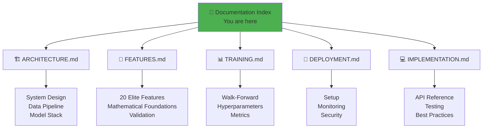

# Technical Documentation Index

Welcome to the Quant_Engine technical documentation suite. This documentation provides comprehensive coverage of the entire system from architecture to deployment.

---

## 📚 Documentation Structure

---

## 📖 Document Summaries

### [ARCHITECTURE.md](ARCHITECTURE.md)
**What**: System-level architecture, data flow, and technology stack  
**For**: System architects, infrastructure engineers  
**Content**:
- High-level system diagram
- Lake architecture (Bronze/Silver/Gold/Platinum)
- Model ensemble design
- Execution layer workflow
- Technology stack and dependencies

**Key Diagrams**: 7 Mermaid diagrams covering end-to-end system flow

---

### [FEATURES.md](FEATURES.md)
**What**: Deep dive into the 20-feature engineering pipeline  
**For**: Quant researchers, data scientists  
**Content**:
- Mathematical formulas for each feature
- Yang-Zhang volatility explained
- Z-Score mean reversion strategies
- Order flow (volume imbalance) proxies
- Feature validation and mutual information scores

**Key Diagrams**: 5 diagrams showing feature transformations

---

### [TRAINING.md](TRAINING.md)
**What**: Training methodology and validation strategy  
**For**: ML engineers, model developers  
**Content**:
- Walk-forward validation setup (756/63 days)
- Base learner hyperparameters (LSTM, GRU, CNN, XGB, RF)
- Judge network meta-learning workflow
- Performance metrics (Sharpe, CAGR, drawdown)
- Adaptive retraining triggers

**Key Diagrams**: 4 diagrams covering training phases

---

### [DEPLOYMENT.md](DEPLOYMENT.md)
**What**: Production deployment and operations guide  
**For**: DevOps engineers, traders  
**Content**:
- Infrastructure setup and prerequisites
- Daily execution flow (Cron-based)
- Position management and risk controls
- Monitoring dashboards and alerts
- Disaster recovery procedures

**Key Diagrams**: 6 operational flowcharts

---

### [IMPLEMENTATION.md](IMPLEMENTATION.md)
**What**: Code-level reference and API documentation  
**For**: Software developers, contributors  
**Content**:
- Project structure and module organization
- Class diagrams (AttentionModel, CNNModel, etc.)
- API reference for key functions
- Configuration constants
- Testing strategy and code style guidelines

**Key Diagrams**: 4 code architecture diagrams

---

## 🚀 Quick Start Paths

### Path 1: Understanding the System (Newcomers)
1. Start with [ARCHITECTURE.md](ARCHITECTURE.md) - Get the big picture
2. Read [FEATURES.md](FEATURES.md) - Understand what signals we use
3. Review [DEPLOYMENT.md](DEPLOYMENT.md) - See how it runs in production

### Path 2: Training Models (Data Scientists)
1. [FEATURES.md](FEATURES.md) - Learn the feature engineering
2. [TRAINING.md](TRAINING.md) - Understand the training pipeline
3. [IMPLEMENTATION.md](IMPLEMENTATION.md) - API reference for custom modifications

### Path 3: Deploying to Production (Engineers)
1. [ARCHITECTURE.md](ARCHITECTURE.md) - System dependencies
2. [DEPLOYMENT.md](DEPLOYMENT.md) - Setup and monitoring
3. [IMPLEMENTATION.md](IMPLEMENTATION.md) - Code structure and debugging

---

## 📊 Diagram Legend

Throughout the documentation, diagrams use consistent color coding:

| Color | Meaning |
|:------|:--------|
| 🟢 Green | Success states, final outputs |
| 🔴 Red | Errors, rejected signals |
| 🟡 Yellow | Decision points, filtering |
| 🔵 Blue | Data processing, transformations |
| 🟠 Orange | Warnings, moderate risk |
| ⚫ Gray | Disabled, inactive states |

---

## 🔗 External References

- **NSE Data Source**: [NSE India Archives](https://www.nseindia.com/all-reports)
- **PyTorch Docs**: [pytorch.org/docs](https://pytorch.org/docs/)
- **XGBoost Guide**: [xgboost.readthedocs.io](https://xgboost.readthedocs.io/)
- **pandas-ta**: [github.com/twopirllc/pandas-ta](https://github.com/twopirllc/pandas-ta)

---

## 📝 Documentation Maintenance

This documentation suite is version-controlled with the codebase.

**Last Updated**: 2024-12-18  
**Version**: 1.0  
**Contributors**: Development Team

---

## 🤝 Contributing to Docs

Found an error or want to improve the documentation?

1. Fork the repository
2. Edit the relevant `.md` file in `docs/`
3. Submit a pull request with:
   - Clear description of changes
   - Screenshots of new diagrams (if applicable)
   - Updated "Last Updated" date

---

## 📧 Support

For technical questions:
- **Issues**: GitHub Issue Tracker
- **Discussions**: GitHub Discussions
- **Email**: support@quantengine.example.com

---

*Happy trading! 🚀*
