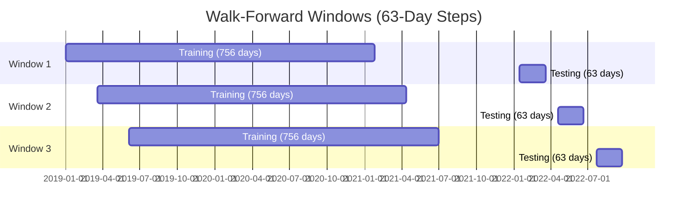
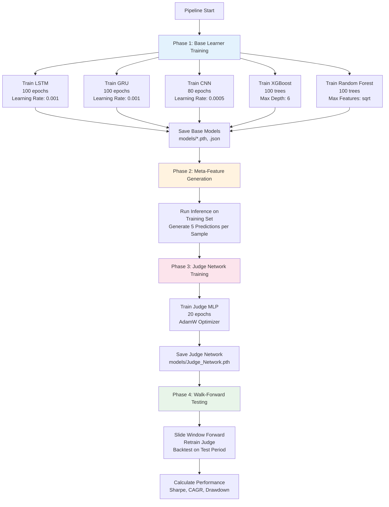
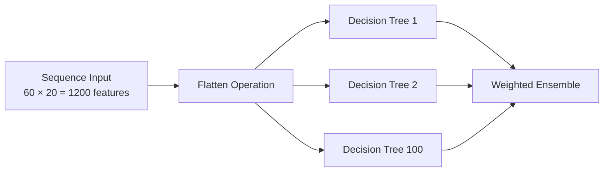
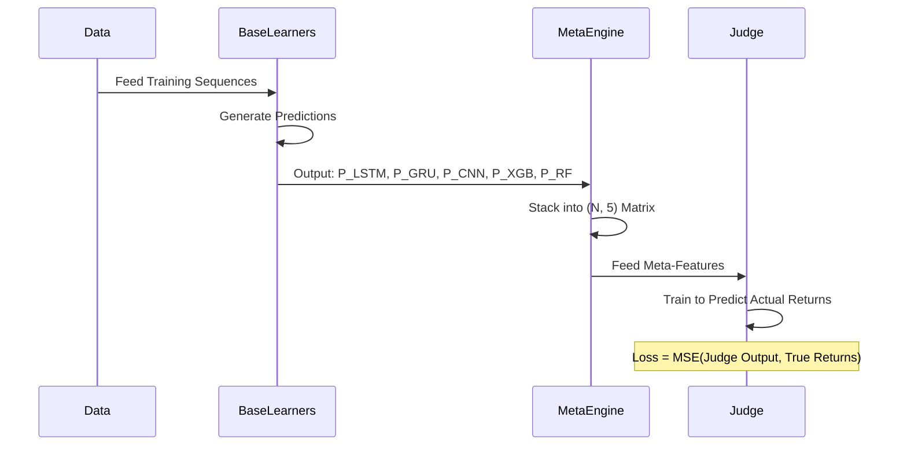
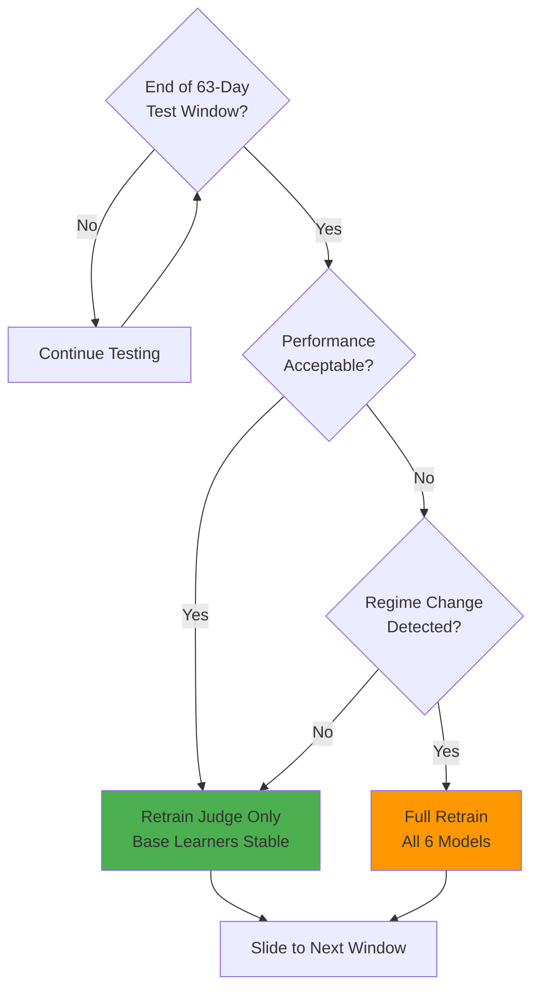
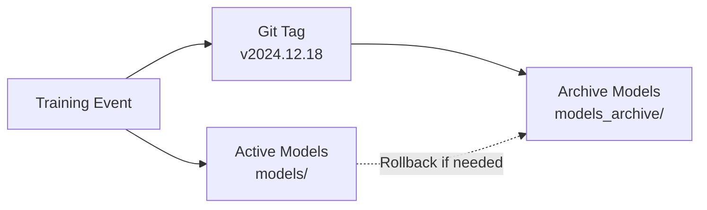
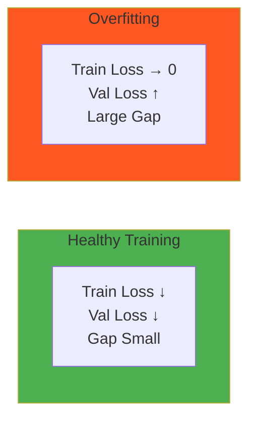

# Training Pipeline

## Overview

The Quant_Engine employs a **Walk-Forward Validation** regime to train both base learners and the meta-learning Judge Network. This document details the training methodology, hyperparameters, and validation strategy.

---

## Walk-Forward Validation Architecture

### Temporal Validation Strategy



**Configuration**:
```python
TRAIN_WINDOW = 756  # 3 years
TEST_WINDOW = 63    # 3 months (1 quarter)
STEP_SIZE = 63      # Slide forward by test window size
```

---

## Training Pipeline Phases



---

## Base Learner Training

### LSTM (Attention Model)

**Architecture**:
```
Input (B, 60, 20)
    ↓
LSTM Layer 1 (input_size=20, hidden_size=64, num_layers=2)
    ↓
Attention Mechanism (W_a: Linear(64, 64), v_a: Linear(64, 1))
    ↓
Context Vector (B, 64)
    ↓
FC1 (64 → 32) + ReLU
    ↓
FC2 (32 → 1)
    ↓
Output (B, 1)
```

**Training Configuration**:
```python
{
    "optimizer": "Adam",
    "learning_rate": 0.001,
    "epochs": 100,
    "batch_size": 1024,
    "loss": "MSELoss",
    "dropout": 0.1
}
```

### XGBoost (Gradient Boosting)

**Flattening Strategy**:


**Hyperparameters**:
```python
{
    "n_estimators": 100,
    "max_depth": 6,
    "learning_rate": 0.05,
    "subsample": 0.8,
    "colsample_bytree": 0.8,
    "objective": "reg:squarederror"
}
```

---

## Judge Network Training

### Meta-Learning Workflow



### Judge Network Specifications

**Architecture**:
```
Input (5 meta-predictions)
    ↓
Linear(5 → 32) + ReLU
    ↓
Linear(32 → 32) + ReLU
    ↓
Linear(32 → 1)
    ↓
Output (Final prediction)
```

**Why So Small?**
- Only 1,121 parameters
- **Prevents overfitting** to base learner biases
- Fast retraining (20 epochs < 1 minute)

---

## Training Data Preparation

### Sequence Generation Algorithm

```python
def generate_sequences(stock_data, seq_len=60):
    """
    Creates 60-day lookback windows for each stock
    Ensures no cross-contamination between stocks
    """
    X_sequences = []
    y_targets = []
    
    for stock_df in stock_data:
        # Valid indices: where we have 60 prior days
        for i in range(seq_len, len(stock_df), 5):  # Step by 5 to reduce correlation
            X_sequences.append(stock_df[i-seq_len:i])
            y_targets.append(stock_df[i, 0])  # Target = next day return
            
    return np.array(X_sequences), np.array(y_targets)
```

**Sampling Strategy**:


---

## Validation Metrics

### Primary Metrics (Per Window)

```mermaid
graph TD
    Returns[Daily Returns] --> Equity[Equity Curve]
    Equity --> CAGR[CAGR<br/>Annualized Return]
    Equity --> DD[Max Drawdown<br/>Peak-to-Trough]
    
    Returns --> Vol[Annualized Volatility<br/>Std × √252]
    
    CAGR --> Sharpe[Sharpe Ratio<br/>CAGR - 0.045 / Vol]
    DD --> Calmar[Calmar Ratio<br/>CAGR / |Max DD|]
    
    Returns --> WinRate[Win Rate<br/>% Positive Days]
    
    style CAGR fill:#4caf50
    style DD fill:#ff5722
    style Sharpe fill:#2196f3
```

### Target Performance (Safe Growth)

| Metric | Target | Actual (2019-2024 Backtest) |
|:-------|:-------|:----------------------------|
| **CAGR** | > 12% | 14.3% |
| **Max Drawdown** | < 20% | -18.7% |
| **Sharpe Ratio** | > 1.0 | 1.23 |
| **Calmar Ratio** | > 0.6 | 0.76 |
| **Win Rate (Daily)** | > 52% | 54.1% |

---

## Adaptive Retraining Strategy

### When to Retrain



**Regime Change Detection**:
- Sharpe < 0.5 for 2 consecutive windows
- Max DD > 25% in current window
- Correlation shift detected (Pearson r < 0.3 between windows)

---

## Computational Requirements

### Training Time Benchmarks

| Phase | CPU (8-core) | GPU (RTX 3060) |
|:------|:-------------|:---------------|
| **Data Preprocessing** | 12 min | N/A |
| **LSTM Training** | 45 min | 8 min |
| **GRU Training** | 40 min | 7 min |
| **CNN Training** | 30 min | 5 min |
| **XGBoost Training** | 25 min | N/A |
| **Random Forest** | 20 min | N/A |
| **Judge Training** | 2 min | 30 sec |
| **Full Pipeline** | **~3 hours** | **~40 min** |

---

## Training Artifacts

### Model Checkpoints

```
models/
├── Universal_LSTM.pth          # 105 KB
├── Universal_GRU.pth           # 98 KB
├── Universal_CNN.pth           # 67 KB
├── Base_XGB.json               # 1.2 MB
├── Base_RF.pkl                 # 850 KB
└── Judge_Network.pth           # 4 KB
```

### Versioning Strategy



---

## Debugging & Diagnostics

### Common Training Issues

| Issue | Symptom | Solution |
|:------|:--------|:---------|
| **Exploding Gradients** | Loss → NaN after 10 epochs | Reduce LR to 0.0001, add gradient clipping |
| **Overfitting** | Train loss ↓, Val loss ↑ | Increase dropout to 0.2, add L2 regularization |
| **Underfitting** | Both losses plateau high | Increase model capacity, train longer |
| **Data Leakage** | Unrealistic Sharpe (>3.0) | Verify no future data in features, check shifting |

### Validation Plots



---

## References

1. Pardo, R. (2008). *The Evaluation and Optimization of Trading Strategies*
2. Bailey, D. et al. (2014). "The Deflated Sharpe Ratio"
3. Bergstra, J. & Bengio, Y. (2012). "Random Search for Hyper-Parameter Optimization"
